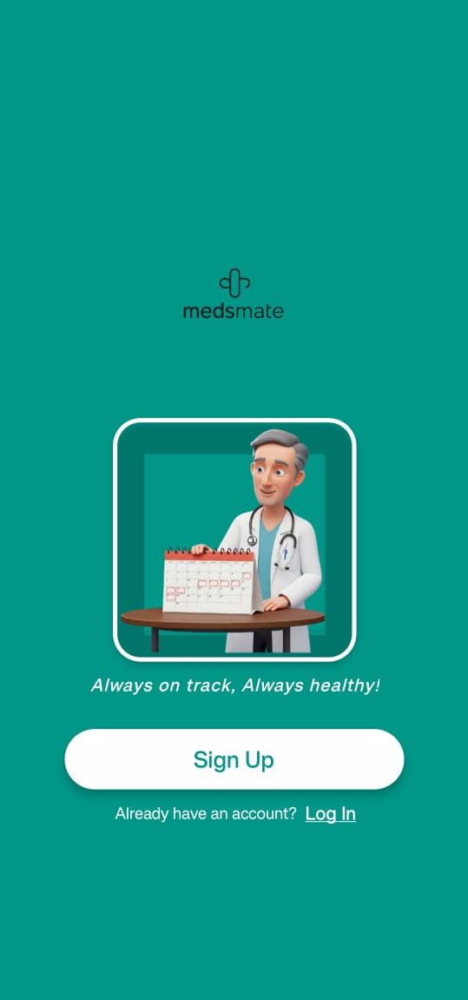
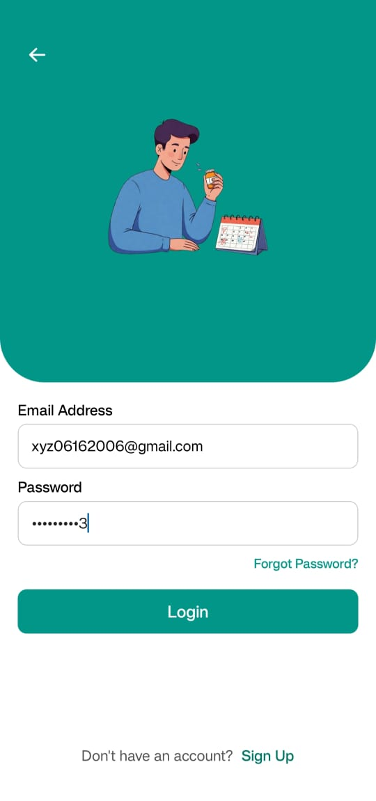
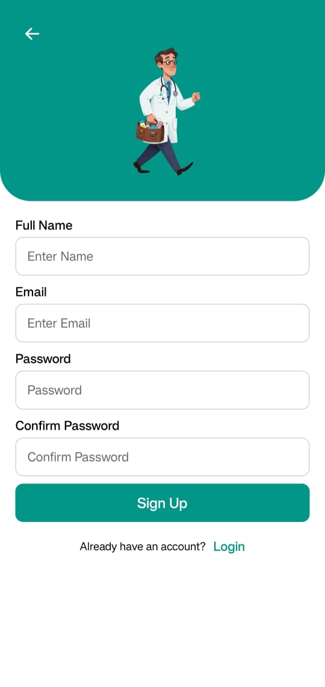
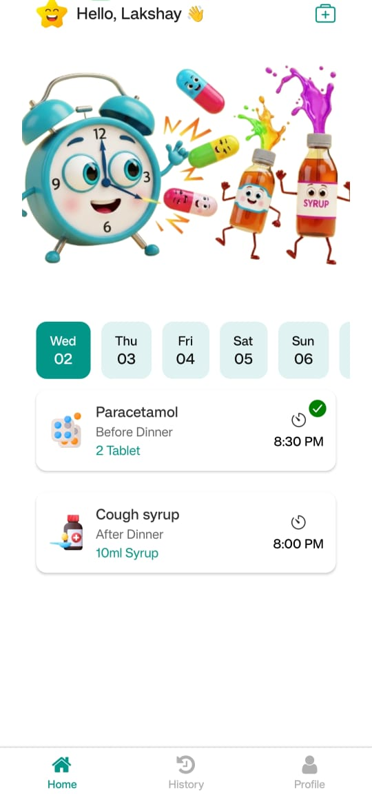
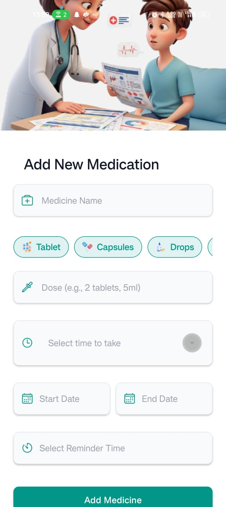
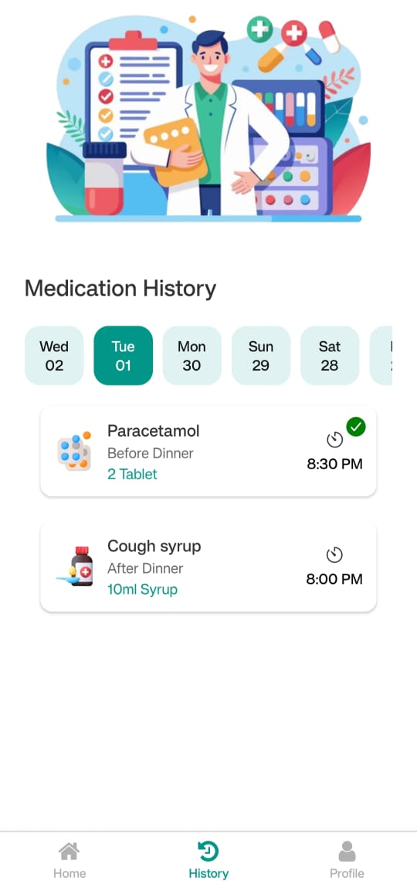

# 💊 MedsMate

MedsMate is a simple and intuitive mobile app built using **React Native (Expo)** and **Firebase**, designed to help users track their daily medications. With a modern interface and useful features like reminders and history tracking, MedsMate ensures users never miss a dose.

---

## 🚀 Features

- 🔐 **Firebase Authentication**
- 💾 **Cloud Firestore** integration
- ➕ Add, edit, and track medications
- 🕒 View medication **history by date**
- ✅ Track medication **status** (Taken / Missed)
- 🧑‍💻 Profile screen & logout
- 📆 Intuitive daily view using **moment.js**
- 🔁 Persistent sessions using AsyncStorage

---

## 📂 Folder Structure

MedsMate/
├── assets/
│ └── images/
├── config/
│ └── FirebaseConfig.js
├── Screens/
│ ├── WelcomeScreen.jsx
│ ├── LoginScreen.jsx
│ └── SignupScreen.jsx
├── Tabs/
│ └── BottomTabs.jsx
├── App.js
├── README.md
└── package.json


---

## 📸 Screenshots


| Welcome | Login | Signup |
|--------|-------|--------|
|  |  |  |

| Home | Add New | History (Taken) |
|------|---------|-----------------|
|  |  |  |

---

## 🔧 Installation & Setup

### 📌 Prerequisites

- Node.js & npm
- Expo CLI (`npm install -g expo-cli`)
- Firebase project set up (Auth + Firestore)

### 🛠️ Getting Started

```bash
git clone https://github.com/Lakshayjoshi24/medsmate.git
cd medsmate
npm install

Made with ❤️ by Lakshay Joshi
